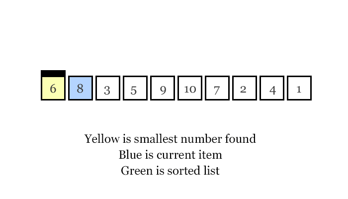
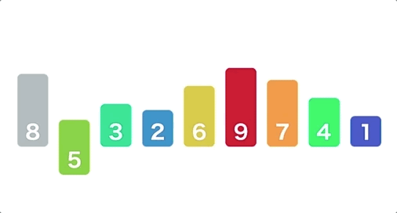
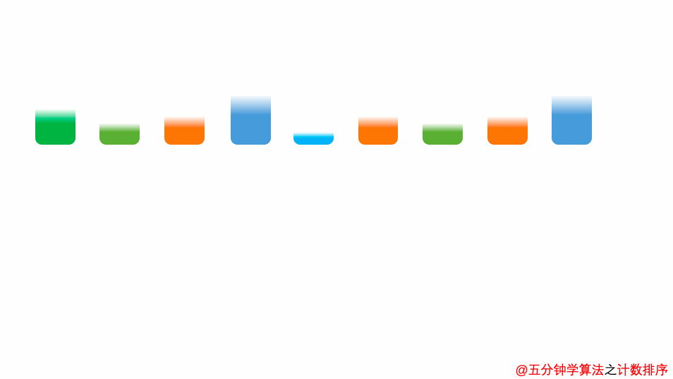
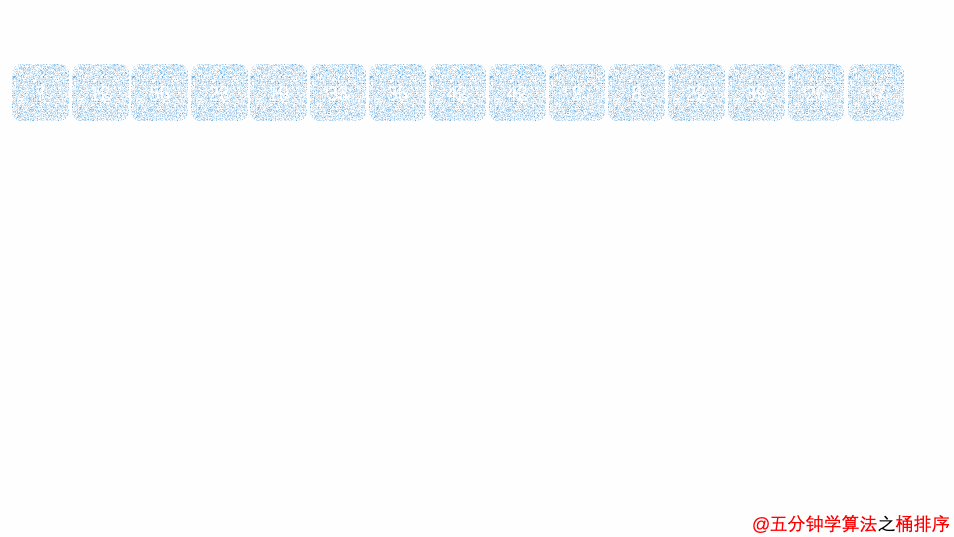

排序算法可以分为内部排序和外部排序。

内部排序是数据记录在内存中进行排序。

而外部排序是因排序的数据很大，一次不能容纳全部的排序记录，在排序过程中需要访问外存。

常见的内部排序算法有：插入排序、希尔排序、选择排序、冒泡排序、归并排序、快速排序、堆排序、基数排序等。


## 稳定性
1. 稳定的排序算法：冒泡排序、插入排序、归并排序和基数排序。

2. 不是稳定的排序算法：选择排序、快速排序、希尔排序、堆排序。

## 冒泡排序
### 算法思想
从第一个和第二个开始比较，如果第一个比第二个大，则交换位置，然后比较第二个和第三个，逐渐往后，经过第一轮后最大的元素已经排在最后，

所以重复上述操作的话第二大的则会排在倒数第二的位置。那重复上述操作 n-1 次即可完成排序，因为最后一次只有一个元素所以不需要比较。


### 代码实现
```go
// BubbleSort 冒泡排序
func BubbleSort(arr []int32) []int32 {
    // 第一层 for 表示循环的遍数
    for i := 0; i < len(arr)-1; i++ {
        // 第二层 for 表示具体比较哪两个元素
        for j := i + 1; j < len(arr); j++ {
            if arr[i] > arr[j] {
                // 如果前面的大于后面的，则交换这两个元素的位置
                arr[i], arr[j] = arr[j], arr[i]
            }
        }
    }
    return arr
}
```

## 选择排序
### 算法思想
设第一个元素为比较元素，依次和后面的元素比较，比较完所有元素找到最小的元素，将它和第一个元素互换，
重复上述操作，我们找出第二小的元素和第二个位置的元素互换，以此类推找出剩余最小元素将它换到前面，即完成排序。



### 代码实现
```go
// SelectionSort 选择排序
func SelectionSort(arr []int32) []int32 {
	// 第一层 for 表示循环选择的遍数
	for i := 0; i < len(arr)-1; i++ {
		// 起始元素设为最小的元素
		minIndex := i
		// 第二层 for 表示最小元素与后面的元素逐个比较
		for j := i + 1; j < len(arr); j++ {
			if arr[j] < arr[minIndex] {
				// 如果当前元素比最小元素小，则把当前元素角标记为最小元素角标
				minIndex = j
			}
		}
		// 查找一遍后将最小元素与起始元素互换
		arr[minIndex], arr[i] = arr[i], arr[minIndex]
	}
	return arr
}
```

## 插入排序
### 算法思想
从第二个元素开始和前面的元素进行比较，如果前面的元素比当前元素大，则将前面元素 后移，当前元素依次往前，直到找到比它小或等于它的元素插入在其后面，

然后选择第三个元素，重复上述操作，进行插入，依次选择到最后一个元素，插入后即完成所有排序。



### 代码实现
```go
// InsertionSort 插入排序
func InsertionSort(arr []int32) []int32 {
	// 第一层 for 表示循环插入的遍数
	for i := 1; i < len(arr); i++ {
		// 设置当前需要插入的元素
		current := arr[i]
		// 与当前元素比较的比较元素
		preIndex := i - 1
		for preIndex >= 0 && arr[preIndex] > current {
			// 当比较元素大于当前元素则把比较元素后移
			arr[preIndex+1] = arr[preIndex]
			// 往前选择下一个比较元素
			preIndex -= 1
		}
		// 当比较元素小于当前元素，则将当前元素插入在其后面
		arr[preIndex+1] = current
	}
	return arr
}
```

## 希尔排序
### 算法思想
希尔排序的整体思想是将固定间隔的几个元素之间排序，然后再缩小这个间隔。这样到最后数列就成为了基本有序数列。

具体步骤：

1. 计算一个增量（间隔）值

2. 对元素进行增量元素进行比较，比如增量值为 7，那么就对 0,7,14,21… 个元素进行插入排序

3. 然后对 1,8,15… 进行排序，依次递增进行排序

4. 所有元素排序完后，缩小增量比如为 3，然后又重复上述第 2，3 步

5. 最后缩小增量至 1 时，数列已经基本有序，最后一遍普通插入即可


### 代码实现
```go
// ShellSort 希尔排序
func ShellSort(arr []int32) []int32 {
	// 取整计算增量（间隔）值
	gap := len(arr) / 2
	for gap > 0 {
		// 从增量值开始遍历比较
		for i := gap; i < len(arr); i++ {
			current := arr[i]
			// 元素与他同列的前面的每个元素比较，如果比前面的小则互换
			preIndex := i
			for preIndex-gap >= 0 && current < arr[preIndex-gap] {
				arr[preIndex] = arr[preIndex-gap]
				preIndex -= gap
			}
			arr[preIndex] = current
		}
		// 缩小增量（间隔）值
		gap /= 2
	}
	return arr
}
```

## 归并排序
### 算法思想
归并排序是分治法的典型应用。分治法（Divide-and-Conquer）：将原问题划分成 n 个规模较小而结构与原问题相似的子问题；递归地解决这些问题，然后再合并其结果，就得到原问题的解，分解后的数列很像一个二叉树。

具体实现步骤：

1. 使用递归将源数列使用二分法分成多个子列

2. 申请空间将两个子列排序合并然后返回

3. 将所有子列一步一步合并最后完成排序

4. 注：先分解再归并


### 代码实现
```go
// MergeSort 归并排序
func MergeSort(arr []int32) []int32 {
	if len(arr) == 1 {
		return arr
	}
	// 使用二分法将数列分两个
	mid := len(arr) / 2
	left := arr[:mid]
	right := arr[mid:]
	// 使用递归运算
	return merge(MergeSort(left), MergeSort(right))
}

// 排序合并
func merge(left []int32, right []int32) []int32 {
	// 排序合并两个数列
	result := make([]int32, 0)
	// 两个数列都有值
	for len(left) > 0 && len(right) > 0 {
		// 左右两个数列第一个最小放前面
		if left[0] <= right[0] {
			head := left[0]
			result = append(result, head)
			left = left[1:]
		} else {
			head := right[0]
			result = append(result, head)
			right = right[1:]
		}
	}
	// 只有一个数列中还有值，直接添加
	result = append(result, left...)
	result = append(result, right...)
	return result
}
```

## 快速排序
### 算法思想
找出基线条件，这种条件必须尽可能简单，不断将问题分解（或者说缩小规模），直到符合基线条件。

具体实现步骤：
1. 先从数列中取出一个数作为基准数。

2. 分区过程，将比这个数大的数全放到它的右边，小于或等于它的数全放到它的左边。

3. 再对左右区间重复第二步，直到各区间只有一个数。  


### 代码实现
```go
// QuickSort 快速排序
func QuickSort(arr []int32) []int32 {
	if len(arr) < 2 {
		// 基线条件：为空或只包含一个元素的数组是 “有序” 的
		return arr
	}
	// 递归条件
	pivot := arr[0]
	var less, greater []int32
	for i, val := range arr {
		if i == 0 {
			continue
		}
		if val <= pivot {
			// 由所有小于基准值的元素组成的子数组
			less = append(less, val)
		} else {
			// 由所有大于基准值的元素组成的子数组
			greater = append(greater, val)
		}
	}
	return append(append(QuickSort(less), pivot), QuickSort(greater)...)
}
```

## 堆排序
### 算法思想
堆分为最大堆和最小堆，是完全二叉树。堆排序就是把堆顶的最大数取出，将剩余的堆继续调整为最大堆，具体过程在第二块有介绍，以递归实现，

剩余部分调整为最大堆后，再次将堆顶的最大数取出，再将剩余部分调整为最大堆，这个过程持续到剩余数只有一个时结束。


### 代码实现
```go
// HeapSort 堆排序
func HeapSort(arr []int32) []int32 {
	for i := 0; i < len(arr); i++ {
		// 第一下 使得第一个元素最小，接下来就从第二个来构造，使得下一个最小，
		heapify(arr[i:])
	}
	return arr
}

// 建堆
// 每次操作完毕 堆顶的元素就是最小的，由于堆的特性，我们只需要从倒数第二层开始就可以了
func heapify(arr []int32) {
	length := len(arr)
	floor := length/2 - 1
	for i := floor; i >= 0; i-- {
		// 然后比较的每一个节点与其两个孩子节点的大小，使得根节点永远是最小的
		// 有一种特殊情况，就是最后一个节点的孩子节点可能不存在，和可能只有一个，所以需要加上一个判断
		root := i
		left := 2*i + 1  // 左节点
		right := 2*i + 2 // 右节点

		if right < length && arr[right] < arr[root] {
			root = right
		}

		if left < length && arr[left] < arr[root] {
			root = left
		}

		// 把父节点换下去并向下调整
		if root != i {
			arr[root], arr[i] = arr[i], arr[root]
		}
	}
}
```

## 计数排序
### 算法思想
对每一个输入元素 x，确定小于 x 的元素个数。利用这一信息，就可以直接把 x 放在它在输出数组上的位置上了，运行时间为 O (n)，但其需要的空间不一定，空间浪费大。

具体实现步骤：
1. 找出待排序的数组中最大和最小的元素

2. 统计数组中每个值为i的元素出现的次数，存入数组C的第i项

3. 对所有的计数累加（从C中的第一个元素开始，每一项和前一项相加）

4. 反向填充目标数组：将每个元素i放在新数组的第C(i)项，每放一个元素就将C(i)减去1



### 代码实现
```go
// CountingSort 计数排序
func CountingSort(arr []int32) []int32 {
	max := getMax(arr)              // 获取最大值
	counter := make([]int32, max+1) // 用于统计个数的空数组
	sortedIndex := 0                // 桶内索引值

	for i := 0; i < len(arr); i++ {
		counter[arr[i]] += 1 // 统计每个元素出现的次数
	}

	for j := 0; j < len(counter); j++ {
		for counter[j] > 0 {
			arr[sortedIndex] = int32(j) // 取出元素
			sortedIndex += 1
			counter[j] -= 1
		}
	}

	return arr
}

// 获取最大值
func getMax(arr []int32) int32 {
	max := arr[0]
	for _, val := range arr {
		if val > max {
			max = val
		}
	}
	return max
}
```

## 桶排序
### 算法思想
为了节省空间和时间，我们需要指定要排序的数据中最小以及最大的数字的值，来方便桶排序算法的运算。

桶排序的算法原理：
1. 设置一个定量的数组当作空桶子.

2. 寻访序列，并且把项目一个一个放到对应的桶子去.

3. 对每个不是空的桶子进行排序.

4. 从不是空的桶子里把项目再放回原来的序列中.



### 代码实现
```go
// BucketSort 桶排序
func BucketSort(arr []int) []int {
	// 原数列的最大值与最小值
	max, min := arr[0], arr[0]
	for _, val := range arr {
		if val > max {
			max = val
		}
		if val < min {
			min = val
		}
	}
	// 这里设置每个桶的容量是5
	bucketCapacity := 5
	// 计算所需桶的个数
	bucketCount := (max - min + bucketCapacity) / bucketCapacity

	buckets := make([][]int, 0, bucketCount)

	for i := 0; i < bucketCount; i += 1 {
		bucket := make([]int, 0)
		// 初始化桶
		buckets = append(buckets, bucket)
	}

	for _, n := range arr {
		// 映射函数
		k := (n - min) / bucketCapacity
		// 分配入桶
		buckets[k] = append(buckets[k], n)
	}

	p := 0

	for _, bucket := range buckets {
		if len(bucket) == 0 {
			continue
		}
		// 给每个桶中的元素排序
		sort.Ints(bucket)
		// 将桶中的元素赋值到原序列
		for _, n := range bucket {
			arr[p] = n
			p += 1
		}
	}

	return arr
}
```

## 基数排序
### 算法思想
基数排序（radix sort）属于 “分配式排序”（distribution sort），又称 “桶子法”（bucket sort）或 bin sort，
顾名思义，它是透过键值的部份资讯，将要排序的元素分配至某些 “桶” 中，藉以达到排序的作用，基数排序法是属于稳定性的排序，
其时间复杂度为 O (nlog (r) m)，其中 r 为所采取的基数，而 m 为堆数，在某些时候，基数排序法的效率高于其它的稳定性排序法。


### 代码实现
```go
// RadixSort 基数排序
func RadixSort(array []int) []int {
	digit := 1

	max := math.MinInt32

	for _, val := range array {
		if val < 0 { // 输入可能为负数，取绝对值
			val = -val
		}
		// 取最大值来判断目前是否已经看到最高位数
		if max < val {
			max = val
		}
	}

	for digit <= max {
		radixCountingSort(array, digit)
		// 递增位数
		digit *= 10
	}

	return array
}

// 计数排序法（递增）
func radixCountingSort(array []int, digit int) {
	// 一个位数可能的值为-9 ~ +9，共19种可能
	var counter [19]int

	for _, n := range array {
		// 先计算出目前要看的位数的值之后，再进行-(-9)的索引值位移
		k := ((n / digit) % 10) + 9

		counter[k] += 1
	}

	for i := 1; i < 19; i += 1 {
		counter[i] += counter[i-1]
	}

	length := len(array)

	origin := make([]int, length)
	copy(origin, array)

	for i := length - 1; i >= 0; i -= 1 {
		n := origin[i]
		k := ((n / digit) % 10) + 9

		counter[k]--
		array[counter[k]] = n
	}
}
```
