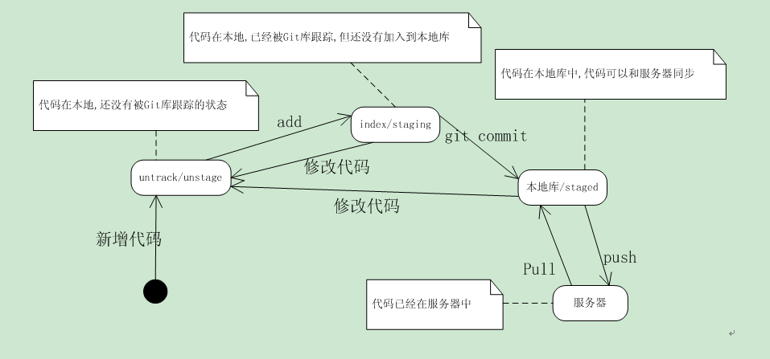

## Git代码状态转换图

其中：
- 未被Git跟踪的状态为unstage状态；
- 已被Git跟踪的状态为stage状态（stage：阶段），因此包括staging状态和staged状态。

untrack files：是指尚未被git所管理的文件；

changed but not updated：是指文件被git管理，并且发生了改变，但改动还没被git管理；

这两种状态，都可以看成是改动还没被git管理的状态，我们这里称unstage状态。

staging是commit和未管理之间的一个状态，也有别名叫index状态，也就是git已经管理了这些改动，但是还没完成提交。

changes to be committed是指进入staged状态的文件。

.gitignore中的文件，不会出现在以上三个状态中。

> 注：
> - 这个图也解释了为啥从远端库拉代码，不需要add、commit。
> - 代码一旦修改，就会成为未被git库跟踪的状态。需要add、commit。

## 大白话Git
1. Git 管理代码，保证代码版本迭代连续性，即：向A分支merge或者push代码时，A分支代码必须是当前代码的上一个版本，不然会产生冲突。
（换句话说：Git 确保当前的本地的代码为最新）

2. Git有修改就有提交，就有新的代码版本，git管理维护的是修改。

3. Git分支存储的是代码副本。

4. push: 实际上就是将本地分支合并到远端库分支；pull:实际就是将远端分支合并到本地分支。

## Git 本地常用操作指令
1. 创建git库
```bash
git init  #在当前目录中生成一个.git 目录（含有.git目录的目录即是git仓库）
```

2. 注册Git用户(用户信息配置)
--->用于在团队合作开发中，表明代码作者。
```bash
git config --global user.name XXX  # 用户名  
git config --global user.email XXX # 用户邮箱
git config --list  # 查看用户信息
```

> 注：加 --global,表示全局设置。

3. 向git库添加修改
```bash
git add [path］ # 会把对应目录或文件，添加到stage状态
git add .  # 会把当前所有的untrack files和changed but not updated添加到stage状态
```

实际上是为修改内容添加index索引。

4. 向版本库提交修改
```bash
git commit –m "XXXX"     # 提交修改,添加注释,文件描述
```

> 注：git 提示： 未有 add 红色字体，未有commit绿色字体，已提交则worktree是干净的

5. 查看当前代码库的状态
```bash
git status
```

6. 查看版本信息
--->实际是查看修改提交信息
```bash
git log
git log --graph  #以图形化（节点）展示当前git库的提交信息。
```

7. 查看指定版本信息
```bash
git show sdjf974654dd….  #(show后面为每次提交系统自动生成的一串哈希值)
git show sdji97 #一般只使用版本号的前几个字符即可
```

8. 撤销修改
   1. 撤销整体修改
   ```bash
   git reset --hard  #回到原来编辑的地方,改动会丢失。（同样适用于团队对于其他人的修改恢复）
   git reset --hard sdv143kvf... #可回到指定的版本#(hard后面为每次提交系统自动生成的一串哈希值)
   git reset [path] # 会改变path指定的文件或目录的stage状态，到非stage状态。
   git reset # 会将所有stage的文件状态，都改变成非stage状态。
   ```
   
   2. 撤销某次修改
   
   回退1个change的写法就是:
   ```bash
   git reset HEAD^
   git reset --soft HEAD~1 # 删除最近的提交，保留你已经完成的工作
   git reset --hard HEAD~1 # 删除最近的提交，销毁你已经完成的工作
   ```
   2个为HEAD^^， 3个为HEAD~3，以此类推。

9. 向远端库推送修改（提交修改）
```bash
git push origin 分支名
```

10. 暂存修改
```bash
git stash # 可以把当前的改动（stage和unstage，但不包括untrack的文件）暂存。
git stash list # 查看暂存的改动
git stash apply # 重新取出暂存的改动。但apply之前要保证worktree是干净的。
```

## Git 团队开发常用操作指令
1. 获取远端库项目
```bash
git  clone/pull xxx.git
```
2. 团队开发的基本流程（多分支合并一个分支）
```bash
git add .   #添加改动的文件
git commit  #（提交至本地）
git pull --rebase  #（将服务器项目与本地项目合并）
git push    #（将本地项目上传至远端库）
```
> 在提交前要git pull --rebase 一下，确保当前的本地的代码为最新。

3. 更新 fork 的仓库
```bash

git remote add upstream xxx.git # 添加远程，称其为 "上游"

git fetch upstream # 把该远程的所有分支取到远程跟踪分支中去

git checkout master # 确保你在你的主分支上

git rebase upstream/master # 重写你的主分支，这样任何不在上游/主分支中的提交都会在其他分支的顶部重放。

git pull upstream xx      # 把本地的xx分支与被fork仓库xx分支同步 

git push upstream xx:xxx  # 推送本地xx分支到被fork仓库的xxx分支上
```

4. tag 的创建与删除
    1. 创建 tag 
    ```bash
    # To create a tag on your current branch, run this:
    git tag <tagname> # 在当前分支上创建一个标签
    
    # If you want to include a description with your tag, add -a to create an annotated tag:
    git tag <tagname> -a # 如果你想在标签中加入描述，可以添加 -a 来创建一个带注释的标签。
    
    # This will create a local tag with the current state of the branch you are on. When pushing to your remote repo, tags are NOT included by default. You will need to explicitly say that you want to push your tags to your remote repo:
    git push origin --tags # 这将创建一个本地标签，包含你所在的分支的当前状态。当推送到远程版本时，默认不包括标签。你需要明确地说，你想把你的标签推送到你的远程 repo
    
    # Or if you just want to push a single tag:
    git push origin <tag> # 或者如果你只想推送一个标签
    
    eg: 
    git tag v1.0.0
    git push origin v1.0.0
    ```

    2. 删除 tag
    ```bash
    # use the --delete option (or -d if your git version is older than 1.8.0):
    git push --delete origin tagname

    # delete the local tag, use:
    git tag --delete tagname # 删除本地标签

    eg:
    git git push --delete origin v1.0.0
    ```
   
## Git 分支管理
1. 建立分支
```bash
git branch AAA   #建立分支AAA
```

2. 分支切换
```bash
git checkout AAA   #从当前分支切换到AAA分支 (若AAA分支不存在，则自动新建)
```

3. 将分支与主枝master合并
```bash
git checkout master   #（首先切换回主枝）
git merge AAA    #（将分支AAA与主枝合并）
```

> 注：git merge：默认情况下，Git执行"快进式合并"（fast-farward merge），会直接将Master分支指向Develop分支。
使用--no-ff参数后，会执行正常合并，在Master分支上生成一个新节点。为了保证版本演进的清晰（保持提交曲线为直线），建议采用这种方法。

4. 当前分支查看
```bash
git branch    #默认有master（也称为主枝）
git branch -r  #查看远端库分支
git branch –a  #查看当前所有分支（包括本地分支和远端库分支）
```

5. 删除分支
```bash
git branch –d  AAA   #删除分支AAA
git push origin --delete AAA #删除远程分支AAA
```

6. 切下远端库A分支到本地库A分支
```bash
git checkout -b  A origin/A  # （若本地A分支不存在，则自动新建）
```

> 注：上面只是一些基本的操作命令，更多的命令可通过帮助文档查询。
帮助文档的使用：

```bash
man git-<需查询的指令>      #（git后面有“-”）
```

如commit的查询为

```bash
man git-commit
```

## 本地代码上传GitHub
1. GitHub上建立远端仓库，复制下载链接。
2. 本地指定目录下，GitBash 粘贴远端仓库下载链接拉取远端仓库代码。
3. 复制本地需要提交的代码到远端仓库目录。
4. Git add、commit、push 提交本地代码至Github远端仓库。

## 参考文档
[Git 基本知识与常用指令](https://www.cnblogs.com/gavincoder/p/9073368.html)